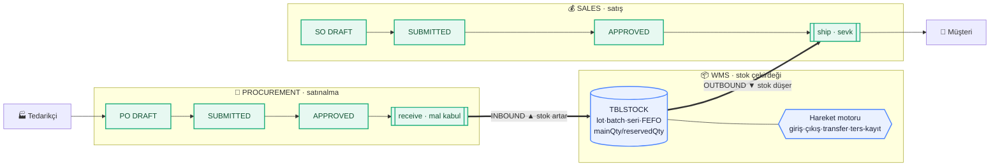

# OneGate — Durum & Akış Şeması

> Tarih: 2026-06-09 · Üretim: `/yap` orkestratörü · Görsel HTML sürüm: `docs/onegate-durum-akis.html`

## Özet sayılar
| Ölçü | Değer |
|---|---|
| Aktif modül / şema | **3** (wms · procurement · sales) |
| Domain tablo | **22** (18 · 2 · 2) |
| Foreign key | **45** |
| Migration | **7** |
| API endpoint | **~48** (13 route grubu) |
| Test | smoke **34/34** + 4 E2E paketi (motor/faz3/procurement/v4) |

## Operasyonel akış (al → stok → sat)

## Tamamlanma — modül/yetenek
| Yetenek | Durum | % |
|---|---|---|
| Marka / Altyapı | ✅ | 100 |
| WMS — Master data | ✅ | 95 |
| WMS — Stok (lot/FEFO/rezerve) | ✅ | 90 |
| WMS — Hareket motoru (giriş/çıkış/transfer/ters) | ✅ | 90 |
| Cari (müşteri/tedarikçi) | ✅ | 80 |
| Sipariş finansı (iskonto/vergi/döviz) | ✅ | 75 |
| Procurement (sipariş→mal kabul) | ✅ | 70 |
| Sales (sipariş→onay→allocate→sevk) | ✅ | 85 |
| Inventory (min/max·MRP·→PO köprüsü) | ✅ | 70 |
| Auth/Tenant/Super-admin | ✅ | 70 |
| RBAC (rol-bazlı yetki + kullanıcı CRUD) | ✅ | 75 |
| Logistics (araç/sevkiyat/durak + sales bağ) | ✅ | 80 |
| Sayım (stocktake: snapshot→say→düzelt) | ✅ | 65 |
| Kalite (muayene→statü geçişi) | ✅ | 65 |
| Fatura/Muhasebe (PO/SO→fatura→tahsilat) | ✅ | 65 |
| Fatura/Muhasebe | ⬜ | 0 |
| Sayım/Kalite/İş emri | ⬜ | 0 |
| AI modülü | ⬜ | 0 |

## Genel yüzdeler
| Boyut | % |
|---|---|
| Çekirdek operasyonel akış (al→stok→sat, uçtan uca) | **~100** (fonksiyonel, E2E kanıtlı) |
| Aktif 3 modülün olgunluğu | **~78** |
| Tablolar — aktif modül çekirdeği (22/~30) | **~73** |
| Tablolar — tüm platform vizyonu (22/~55) | **~40** |
| İleri akışlar (rezervasyon-tahsis/iade/sayım/fatura/RBAC) | **~25** |
| Tüm platform vizyonu (5 modül + AI) | **~40** |

> Legacy "SB" WMS = 460 tablo. OneGate kasıtlı **sade yeniden tasarım** — sayıca değil fonksiyonel omurga hedefi. 22 tablo legacy'nin en merkezi entity'lerini kapsıyor.

## Neredeyiz & sonraki adım
**Neredeyiz:** Satın al → mal kabul → **stok** → satış → sevk zinciri uçtan uca çalışıyor ve test edildi. Çok-kiracılı, lot/batch/seri/FEFO stok, hareket motoru (ters-kayıt), rezervasyon, sipariş finansı, super-admin tenant kilidi yerinde. **Operasyonel olarak ayakta.**

**Sonraki adım (öncelik sırası):**
1. **Inventory** — min/max + MRP (otomatik satınalma önerisi).
2. **Satış sevki ↔ rezervasyon** entegrasyonu (order→reserve→pick→ship).
3. **RBAC** — rol-bazlı yetki enforcement + kullanıcı CRUD.
4. **Logistics** — sevkiyat/rota/araç.
5. **Fatura/muhasebe** — PO/SO finansından fatura.
