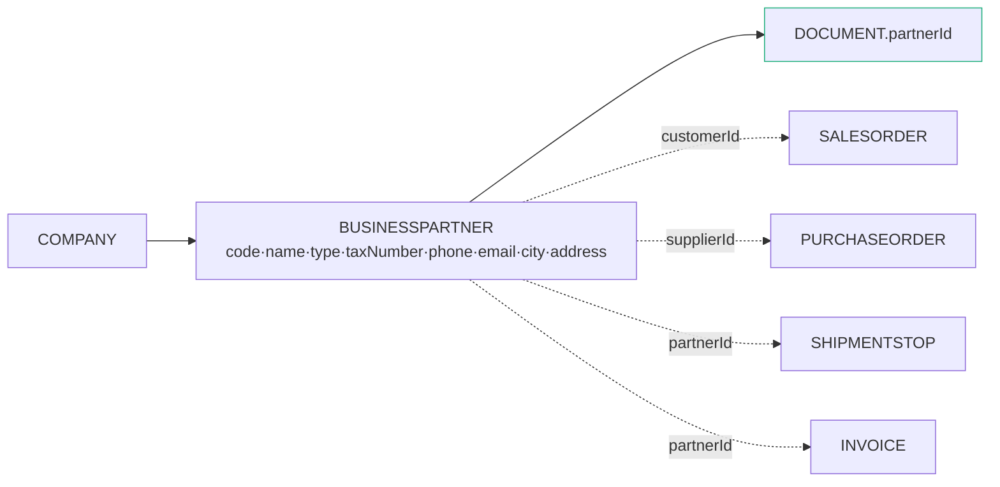
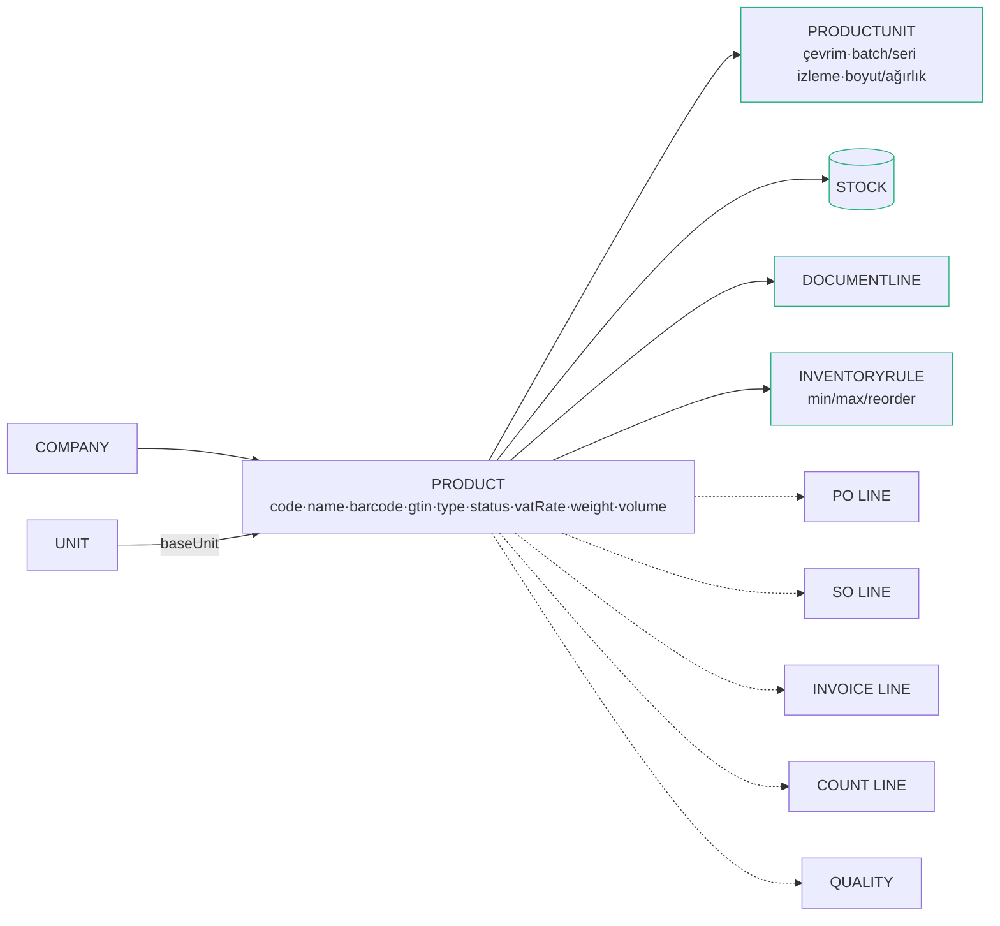
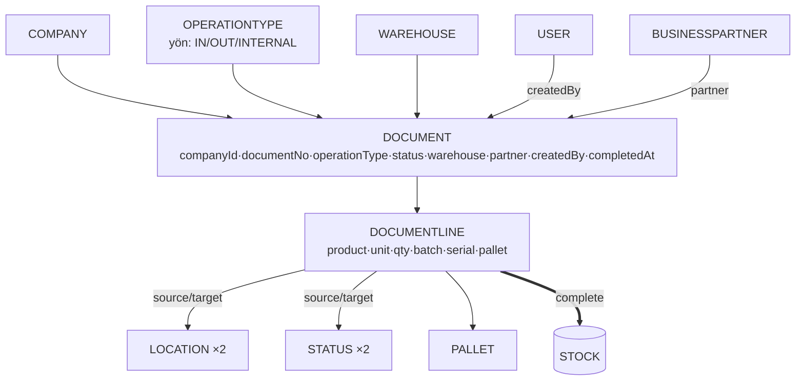
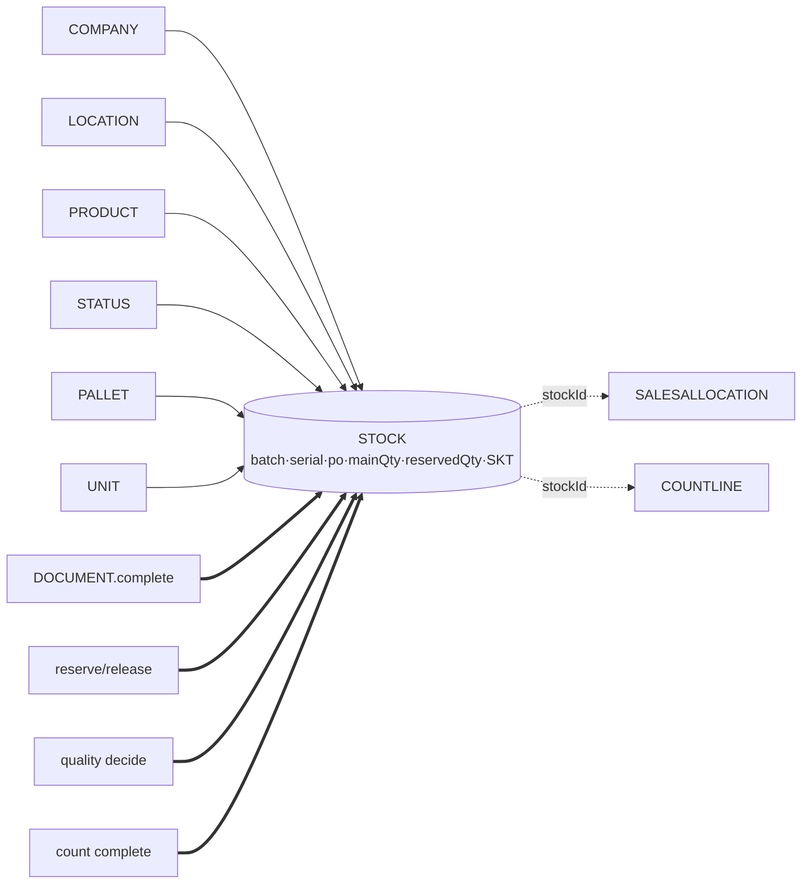

# OneGate — Veri Modeli Haritası & Boşluk Kontrolü

> 2026-06-09 · 32 tablo · 5 şema · 53 gerçek FK + cross-schema gevşek bağlar
> **Bağ tipleri:** `──▶` gerçek FK (intra-schema) · `┄┄▶` gevşek bağ (cross-schema, id ile, FK yok)

---

## 1. Genel çerçeve (tüm tablolar, şema bazında)

```mermaid
flowchart TB
  subgraph WMS["wms (19)"]
    CO[COMPANY]:::root
    US[USER/ROLE/USERROLE]
    BP[BUSINESSPARTNER\ncari]
    WH[WAREHOUSE]; AR[AREA]; LO[LOCATION]
    UN[UNIT]; PR[PRODUCT]; PU[PRODUCTUNIT]
    ST[STATUS]; PT[PALLETTYPE]; PA[PALLET]
    OT[OPERATIONTYPE]
    STK[(STOCK)]:::heart
    DOC[DOCUMENT/LINE]
    IR[INVENTORYRULE]
    SC[STOCKCOUNT/LINE]; QC[QUALITYINSPECTION]
  end
  subgraph PROC["procurement (2)"]
    PO[PURCHASEORDER/LINE]
  end
  subgraph SAL["sales (3)"]
    SO[SALESORDER/LINE]; AL[SALESALLOCATION]
  end
  subgraph LOG["logistics (3)"]
    VE[VEHICLE]; SH[SHIPMENT/STOP]
  end
  subgraph FIN["finance (2)"]
    INV[INVOICE/LINE]
  end
  PO ┄┄> WH & BP & PR
  SO ┄┄> WH & BP & PR
  AL ┄┄> STK
  SH ┄┄> BP & SO
  INV ┄┄> BP & PR
  PO ==>|receive| DOC
  SO ==>|ship| DOC
  DOC ==>|complete| STK
  classDef root fill:#eaf1ff,stroke:#4e86ff
  classDef heart fill:#e7f8f1,stroke:#22b07d,stroke-width:2px
```

---

## 2. 🧑‍💼 MÜŞTERİ / CARİ — `TBLBUSINESSPARTNER` (wms)

Tek tablo hem müşteri hem tedarikçi (`type: CUSTOMER/SUPPLIER/BOTH`).


**Bağlı:** belge · satış sipariş · satınalma sipariş · sevkiyat durağı · fatura. **Alanlar:** kod, ad, tip, vergi no, telefon, e-posta, şehir, tek adres.

---

## 3. 📦 ÜRÜN — `TBLPRODUCT` (wms)


**Bağlı:** birim+çevrim · stok · belge satırı · min/max kuralı · sipariş/fatura/sayım/kalite satırları.

---

## 4. 📄 BELGE — `TBLDOCUMENT` + `TBLDOCUMENTLINE` (wms)

Tüm stok hareketinin tek modeli: **kaynak→hedef**.


**Üreten:** mal kabul (PO), sevk (SO), transfer, sayım farkı, kalite statü geçişi. **Yaşam döngüsü:** DRAFT→CONFIRMED→COMPLETED→(reverse)CANCELLED.

---

## 5. 🟢 STOK — `TBLSTOCK` (wms) — kalp


**İzleme kırılımı (unique):** company×location×product×status×batch×serial×pallet. **Güncelleyen:** belge tamamlama · rezervasyon · sayım · kalite.

---

## 6. 🔎 BOŞLUK KONTROLÜ — atladığımız / sığ kalan

| Alan | ✅ Var | ⚠️ Eksik / sığ |
|---|---|---|
| **Cari** | tek tablo (müşteri+tedarikçi), temel alanlar | **Cari hesap/ekstre yok** (bakiye, borç/alacak hareketi) · çoklu adres (sevk/fatura) · çoklu iletişim kişisi · ödeme vadesi/risk limiti |
| **Ürün** | çok-birim, barkod, batch/seri izleme flag · ✅ **ürün grup tablosu** (TBLPRODUCTGROUP = legacy TBLURUNGRUP) | maliyet/fiyat (legacy URUN'da da net yok) · **tedarikçi-ürün** · muadil · varyant · resim · _(NOT: lot/seri master legacy'de YOK — batch/serial string alan; eklenen geri alındı)_ |
| **Belge** | kaynak→hedef hareket, yaşam döngüsü, ters kayıt | **Numara serisi** (otomatik no) yok · belge-belge bağı (iade→orijinal) · ek/dosya · çok seviyeli onay · neden kodu |
| **Stok** | lot/batch/seri/palet/FEFO/rezerve (legacy STOKDURUM gibi) | maliyet/değerleme (legacy STOKDURUM'da da yok) · hareket geçmişi belge satırından türetiliyor · _(NOT: TBLSTOCKLEDGER legacy'de YOK — eklenen geri alındı)_ |
| **Fatura** | PO/SO→fatura, kesim, tahsilat | **Muhasebe/GL entegrasyonu yok** · e-fatura/e-irsaliye (TR) yok · tahsilat **ledger** yok (paidAmount alanı var, hareket kaydı yok) · iade faturası yok |
| **Para/döviz** | sipariş/faturada currency+exchangeRate | **Merkezi döviz kuru tablosu yok** (kur geçmişi) · para birimi master yok |
| **Üretim** | — | **Üretim/iş emri + BOM yok** (legacy'de vardı) |
| **Çapraz** | createdAt/updatedAt | **Audit log yok** (kim neyi değiştirdi) · bildirim/notification · **adres normalizasyonu** · depo-arası transfer belge tipi netleştirilmeli |

### En kritik 3 boşluk (öneri sırası)
1. **Maliyet/stok değerleme** — hiçbir yerde birim maliyet yok; stok değeri raporlanamıyor. (Ürün'e cost / hareket'e maliyet.)
2. **Cari hesap defteri** — fatura var ama bakiye/ekstre yok; tahsilat hareketi tutulmuyor.
3. **Kalıcı stok hareket ledger** — şu an stok kartı belge satırından türetiliyor; ayrı `TBLSTOCKLEDGER` daha sağlam (rezerve/sayım/kalite dahil tüm hareketler).
