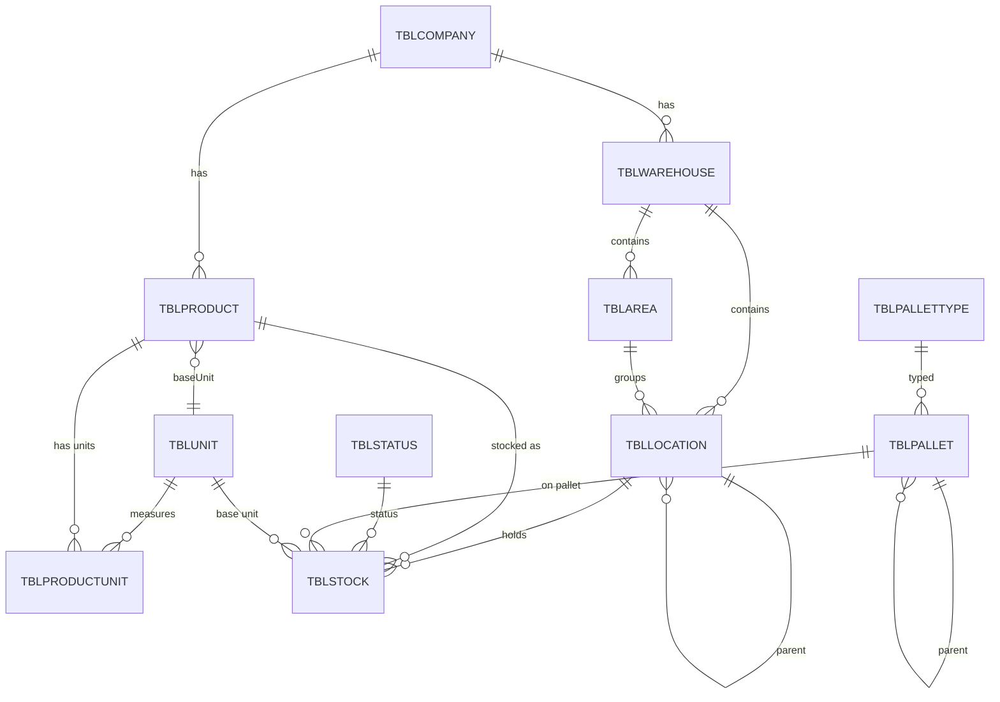

# OneGate WMS — Legacy Keşif & Eşleştirme Dokümanı

> **Durum:** Keşif (discovery only) — bu aşamada KOD/migration YOK.
> **Kaynak:** `tablo/tablolar.xlsx` — mevcut "SB" WMS sisteminin tam SQL Server şema dökümü.
> **Üretildi:** 2026-06-08 · Tech Lead orkestrasyonu (`/yap`)
> **Artefaktlar:** `tablo/_katalog.json` (460 tablo tam katalog), `tablo/_tum_tablolar.txt`

Bu doküman legacy WMS'i çözer ve OneGate'e **nasıl** eşleneceğini tanımlar. Onaylanan mimari kararlar (aşağıda §4) buraya gömülmüştür. Modelleme (schema.prisma + migrate) bir sonraki fazda, bu haritaya göre yapılacak.

---

## 1. Kaynak sistem özeti

| Ölçü | Değer |
|---|---|
| Toplam tablo | **460** |
| Toplam kolon | 6.247 |
| FK ilişkisi | 581 |
| PK/Index kaydı | 1.099 |
| Prefix | Baştan sona `TBLSB*` (OneGate'te **yasak** → `TBL` + İngilizce) |
| WMS-doğrudan tablo | ~128 / 460 |

**Karakteristik:** Çok-kiracılı (distribütör bazlı), lot/batch/seri izlemeli, palet ve lokasyon-ağacı tabanlı, kaynak→hedef hareket modelli olgun bir WMS. Geri kalan tablolar entegrasyon, üretim, kalite, IoT, raporlama, mail vb.

---

## 2. İsimlendirme & tip dönüşüm kuralları

Legacy kolon adları **Hungarian prefix** taşır; tip buradan okunur:

| Legacy prefix | SQL tipi | Anlam | OneGate / Prisma karşılığı |
|---|---|---|---|
| `LNG` | int | `LNGKOD`=PK(identity), `LNG…KOD`=FK | `Int @id @default(autoincrement())` / `Int` + relation |
| `TXT` | n/varchar | `TXTKOD`=doğal kod, `TXTTANIMI`/`TXTAD`=ad | `String @db.VarChar(n)` |
| `TRH` | datetimeoffset | tarih-saat | `DateTime` (timestamptz) |
| `TRH` | date | sade tarih (SKT, üretim) | `DateTime @db.Date` |
| `BYT` | tinyint | **bayrak** (`BYTAKTIF`) / **tip** (`BYT…TIP`) | `Boolean` (bayrak) · `enum` (tip) |
| `DBL` | decimal(28,8) | miktar/ağırlık/boyut | `Decimal @db.Decimal(28,8)` |

**Ad çevirisi (legacy TR → OneGate EN):**
`KOD→code` · `TANIMI/AD→name` · `KISAAD→shortName` · `DEPO→warehouse` · `ALAN→area` · `LOKASYON→location` · `URUN/MALZEME→product` · `BIRIM→unit` · `STATU→status` · `PALET→pallet` · `BELGE→document` · `MIKTAR→quantity` · `REZERVE→reserved` · `BATCH→batch` · `SERI→serial` · `KAYNAK→source` · `HEDEF→target` · `MUSTERI→customer` · `TEDARIKCI→supplier` · `OPERASYONTIPI→operationType`.

---

## 3. Evrensel desen kararları

Legacy'de her tabloda tekrar eden desenler ve OneGate'te nasıl ele alınacağı:

### 3.1 Audit (4'lü → 4'lü)
Legacy her tabloda: `TRHILKISLEMTARIHI`, `TRHSONISLEMTARIHI`, `LNGILKKULLANICIKOD`, `LNGSONKULLANICIKOD`.
**OneGate standardı (her ana tabloya):**
```
createdAt   DateTime  @default(now())
updatedAt   DateTime  @updatedAt
createdById Int?      // → TBLUSER
updatedById Int?      // → TBLUSER
```

### 3.2 Çok-kiracılık (KARAR: baştan aktif)
Legacy `LNGDISTKOD → TBLDIST` neredeyse her tabloda. OneGate'te ayrı bir **`TBLCOMPANY`** (tenant) tablosu açılır; legacy'de tenant ile cari/iş-ortağı aynı tabloda (TBLDIST) karışmış — OneGate'te **ayrıştırılır** (TBLCOMPANY = kiracı; müşteri/tedarikçi sonraki fazda ayrı).
**Her ana tabloya:** `companyId Int` + `@@index([companyId])`. Doğal kod benzersizliği tenant-scoped: `@@unique([companyId, code])`.

### 3.3 Arşiv deseni
Legacy transaction tablolarında composite PK `(BYTARSIV, LNGKOD)`. OneGate'te **PK'ya katılmaz**; gerekirse `isArchived Boolean @default(false)` + partial index. Sıcak/soğuk ayrımı ileride partition/archive job ile.

### 3.4 Dinamik alanlar (KARAR: şimdilik YOK)
Legacy `TBLEKSAHATANIMLAMA` + `*EKSAHA` (EAV motoru) **taşınmaz**. İhtiyaç çıkınca tekrar değerlendirilir. Çekirdek **tiplenmiş kolonlarla** kurulur.

### 3.5 Tinyint bayrak/tip
`BYTAKTIF/BYTDURUM` → `Boolean` veya durum `enum`'u. `BYT…TIP` → anlamlı `enum` (örn. `LocationType`, `ProductType`).

---

## 4. Onaylanan mimari kararlar (2026-06-08)

| # | Karar | Seçim |
|---|---|---|
| 1 | Yaklaşım | **Önce keşif** (bu doküman) → sonra temiz çekirdek + artımlı derinlik |
| 2 | Stok izleme | **Lot/batch/seri + SKT** (tam WMS stok) |
| 3 | Çok-kiracılık | **Baştan çok-kiracılı** (companyId her ana tabloda) |
| 4 | Dinamik alan | **Şimdilik yok** (tiplenmiş kolon) |

---

## 5. Fazlama planı

| Faz | Kapsam | Legacy kaynak |
|---|---|---|
| **1 — Fiziksel çekirdek + stok** | Company, Warehouse, Area, Location(ağaç), Unit, ProductUnit, Product, Status, PalletType, Pallet, **Stock** | DEPO, ALAN, LOKASYON, BIRIM, URUNOLCUBIRIM, URUN, STATU, PALETTIPI, PALET, STOKDURUM |
| **2 — Belge / hareket motoru** | Document(başlık/detay), OperationType, kaynak→hedef hareket, rezervasyon | BELGEBASLIK/DETAY, OPERASYONTIPI |
| **3 — Operasyon derinliği** | Sayım, kalite, iş emri, toplama emri | SAYIMBELGE*, KALITE*, ISEMRI*, TOPLAMAEMRI* |
| **4 — Çevre** | Entegrasyon, IoT, raporlama, mail | ENTEGRASYON*, IOT*, RAPOR*, MAIL* |

> Mevcut OneGate şemasındaki `TBLDOCUMENT/TBLDOCUMENTLINE` (basit qty) Faz 2'de **kaynak→hedef hareket modeline** evrilecek; şu anki haliyle geçici.

---

## 6. Legacy → OneGate tablo eşleştirme (Faz 1)

| Legacy tablo | OneGate tablo | Not |
|---|---|---|
| `TBLDIST` (tenant kısmı) | **`TBLCOMPANY`** (yeni) | tenant; cari/iş-ortağı ayrıştırıldı |
| `TBLSBDEPO` | `TBLWAREHOUSE` (mevcut, +companyId) | ~ aynı |
| `TBLSBALAN` | **`TBLAREA`** (yeni) | depo içi alan/zone |
| `TBLSBLOKASYON` | `TBLLOCATION` (mevcut → revize) | +parentId ağaç, +areaId, +barcode, +isRamp, +priority |
| `TBLSBBIRIM` | `TBLUNIT` (mevcut, +companyId,+type) | ~ aynı |
| `TBLSBURUNOLCUBIRIM` | **`TBLPRODUCTUNIT`** (yeni) | ürün×birim çevrim + **batch/seri izleme flag'i** + boyut/ağırlık |
| `TBLURUN` (131 kol) | `TBLPRODUCT` (mevcut → derinleştir) | anlamlı master alanlar; çok-birim/barkod → TBLPRODUCTUNIT'e |
| `TBLSBSTATU` | **`TBLSTATUS`** (yeni) | stok statüsü (available/quarantine/blocked…) |
| `TBLSBPALETTIPI` | **`TBLPALLETTYPE`** (yeni) | palet tipi + bölünme/batch kontrol bayrakları |
| `TBLSBPALET` | **`TBLPALLET`** (yeni) | paletNo, tip, iç içe palet, beacon |
| `TBLSBSTOKDURUM` | **`TBLSTOCK`** (yeni) | **stok kalbi** — izleme kırılımı |
| `TBLKULLANICI` / `TBLSBROL*` | `TBLUSER`/`TBLROLE` (mevcut) | auth zaten var; +companyId scope |

---

## 7. Hedef ER — Faz 1 entity tanımları

> Notasyon: `→` FK ilişki. Tüm ana tablolarda örtük olarak: `companyId`, `createdAt/updatedAt/createdById/updatedById`.

### TBLCOMPANY *(yeni — tenant)*
`id` · `code` (unique) · `name` · `taxNumber?` · `isActive` · audit
← tüm ana tabloların `companyId` hedefi

### TBLWAREHOUSE *(mevcut, +companyId)* ← TBLSBDEPO
`id` · `companyId→TBLCOMPANY` · `code` · `name` · `isActive` · audit
`@@unique([companyId, code])`

### TBLAREA *(yeni)* ← TBLSBALAN
`id` · `companyId` · `warehouseId→TBLWAREHOUSE` · `code` · `name` · `isActive`
`@@unique([companyId, code])`

### TBLLOCATION *(revize)* ← TBLSBLOKASYON
`id` · `companyId` · `warehouseId→TBLWAREHOUSE` · `areaId?→TBLAREA` · `parentId?→TBLLOCATION` *(self-ref ağaç; legacy LNGUSTKOD)* · `code` · `name?` · `type:LocationType` · `barcode?` · `isRamp:Boolean` · `status:LocationStatus` · `priority?` · audit
`@@unique([companyId, warehouseId, code])`

### TBLUNIT *(mevcut, +)* ← TBLSBBIRIM
`id` · `companyId` · `code` · `name` · `type:UnitType?` · `referenceCode?` · `isActive`

### TBLPRODUCT *(derinleştir)* ← TBLURUN *(131→~25 anlamlı)*
`id` · `companyId` · `code` · `name` · `shortName?` · `productGroupCode?` · `manufacturerCode?` · `vatRate?` · `type:ProductType` · `status:ProductStatus` · `weight?` · `volume?` · `gtin?` · `barcode?` · `baseUnitId→TBLUNIT` · audit
> Legacy'deki 5'li BIRIM/BARKOD/CEVRIM setleri **TBLPRODUCTUNIT**'e taşınır (normalize).

### TBLPRODUCTUNIT *(yeni)* ← TBLSBURUNOLCUBIRIM
`id` · `productId→TBLPRODUCT` · `unitId→TBLUNIT` · `isBaseUnit:Boolean` · `multiplier:Decimal` · `divisor:Decimal` · `barcode?` · `length?/width?/height?/area?/volume?` · `netWeight?/grossWeight?` · `weightUnitId?→TBLUNIT` · **`batchTracking:Boolean`** · **`serialTracking:Boolean`** · `minPalletQty?/maxPalletQty?` · `isSalesUnit:Boolean`
`@@unique([productId, unitId])`

### TBLSTATUS *(yeni)* ← TBLSBSTATU
`id` · `companyId` · `code` · `name` · `isActive`
> Örnek değerler: `AVAILABLE`, `QUARANTINE`, `BLOCKED`, `DAMAGED`.

### TBLPALLETTYPE *(yeni)* ← TBLSBPALETTIPI
`id` · `companyId` · `code` · `name` · `type:PalletKind?` · `isDivisible:Boolean` · `batchControl:Boolean` · `singleProductControl:Boolean` · `palletNoLength?` · audit

### TBLPALLET *(yeni)* ← TBLSBPALET
`id` · `companyId` · `palletNo` · `palletTypeId→TBLPALLETTYPE` · `parentPalletId?→TBLPALLET` *(iç içe)* · `baseUnitId?→TBLUNIT` · `originalQty?` · `productionDate?` · `expiryDate?` · `beaconId?` · `isActive` · audit
`@@unique([companyId, palletNo])`

### TBLSTOCK *(yeni — STOK KALBİ)* ← TBLSBSTOKDURUM
`id` · `companyId` · `locationId→TBLLOCATION` · `productId→TBLPRODUCT` · `statusId→TBLSTATUS` · `batchNo?` · `serialNo?` · `palletId?→TBLPALLET` · `customerId?` · `poNo?` · `poLine?` · **`mainQty:Decimal(28,8)`** · **`reservedQty:Decimal(28,8)`** · `baseUnitId→TBLUNIT` · `netWeight?` · `grossWeight?` · `expiryDate?` · `productionDate?` · audit
**İzleme kırılımı (unique):** `@@unique([companyId, locationId, productId, statusId, batchNo, serialNo, palletId])`
**Index:** `[productId]`, `[locationId]`, `[expiryDate]` (FEFO için).

---

## 8. ER diyagramı (Faz 1)



---

## 9. Açık sorular / sonraki adım

**Netleştirilecek (modellemeden önce):**
1. `Decimal` hassasiyeti: legacy `(28,8)`; OneGate mevcut belge satırı `(18,3)`. Stok/miktar için **(28,8)** öneriliyor — onay?
2. Müşteri/Tedarikçi (cari) Faz 1'de gerekli mi, yoksa Faz 2'de mi? (Legacy `TBLDIST`/`TBLMUSTERI` çok geniş.)
3. `TBLSTATUS` sabit enum mu (AVAILABLE/QUARANTINE/BLOCKED) yoksa tablo-driven mı? (Legacy tablo-driven → esnek. Çok-kiracıda tablo daha mantıklı.)
4. Mevcut `TBLDOCUMENT/LINE` Faz 1'de duruyor mu, yoksa Faz 2 hareket modeline kadar dondurulsun mu?

**Sonraki adım:** Onay → `schema.prisma`'yı bu §7'ye göre kur, `npx prisma migrate dev --name wms_phase1_core` çek, seed'i companyId ile güncelle.
